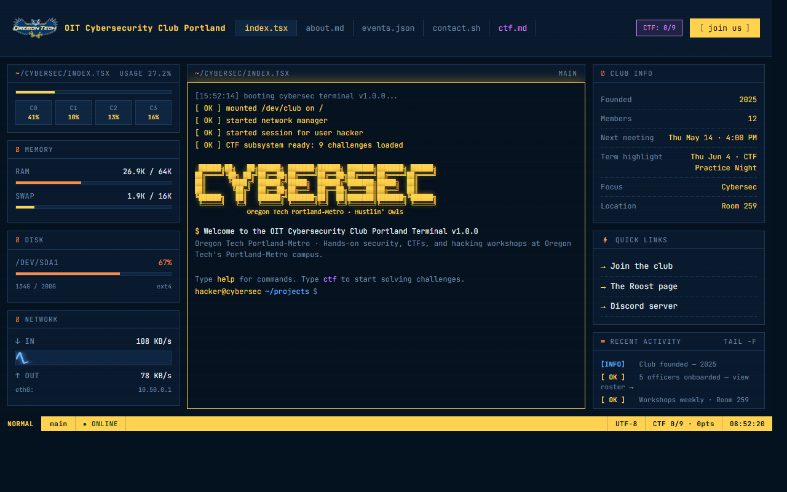
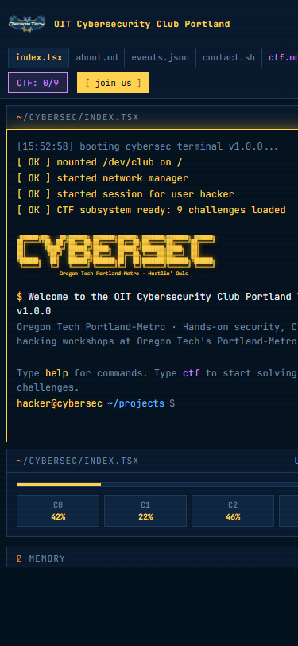

# OIT Cybersecurity Club Portland

Website for the [OIT Cybersecurity Club Portland](https://theroost.oit.edu/feeds?type=club&type_id=35576&tab=about) — Oregon Tech's Portland-Metro campus cybersecurity / CTF club.

A single-file static site with a working in-browser terminal, a real Python REPL via Pyodide, and a 10-challenge CTF embedded throughout the page.



<details>
<summary>Mobile view</summary>



</details>

## What's inside

- **In-browser terminal** — `help` lists 30+ commands (`nmap`, `ping`, `dig`, `whois`, `tree`, `cowsay`, `neofetch`, etc.). Tab-complete and `↑/↓` history work.
- **Real Python REPL** — `python` drops you into Pyodide running in WebAssembly. ~10 MB lazy-load on first use.
- **10-challenge CTF** — recon, console, base64, ROT13, obfuscation, XOR, steganography, nmap_recon, sql_injection, jwt_tamper. Progress persists in `localStorage`. Run `ctf list` in the page terminal.
- **Auto-updating meeting schedule** — events page rolls forward to the next 5 Thursdays automatically.
- **Oregon Tech Hustlin' Owls branding** — athletics mascot logo + navy/gold palette.

## Run locally

```bash
# Easiest
open index.html         # macOS
xdg-open index.html     # Linux
start index.html        # Windows

# Or serve via a local HTTP server (recommended for testing Pyodide / fetch)
python3 -m http.server 8000
# → http://localhost:8000
```

No build step. No `npm install`. The only runtime dependency (Pyodide) is loaded from a CDN on demand.

## Editing

Routine edits — club name, officers, meeting time, links — live in the `CONFIG` object near the top of `index.html`. Changing values there updates the page on next reload.

For anything beyond `CONFIG` updates, see [CLAUDE.md](CLAUDE.md) — it's the architectural reference and explains the terminal engine, CTF system, deployment setup, and conventions for adding new challenges or commands.

## Deployment

Configured for **Cloudflare Workers Static Assets** via `wrangler.jsonc`. Pushes to `main` auto-deploy via Cloudflare's GitHub integration. The `.assetsignore` keeps documentation files (`CLAUDE.md`, `README.md`, `wrangler.jsonc`) off the public site.

To deploy elsewhere (GitHub Pages, Netlify, Vercel), just point at the repo — `index.html` is self-contained and the wrangler files are harmless to other hosts.

## Meetings

Thursdays, 4:00 PM, Room 259 — Oregon Tech Portland-Metro campus.

## Contact

- The Roost: [club page](https://theroost.oit.edu/feeds?type=club&type_id=35576&tab=about)
- Sign up: [club_signup](https://theroost.oit.edu/PMCYB/club_signup)
- Officers and emails: see the `contact.sh` page on the live site

## Credits

Visual design inspired by [BeaverHacks](https://beaverhacks.org/). Owl artwork from Oregon Tech Athletics.
